# Pet Adoption Platform
---

A modern, full-featured Pet Adoption Web Application built with React — connecting loving families with pets in need.

---

## Overview

Clean UI • Fast Performance • Fully Responsive • Secure Authentication

## Screenshots

**Registered User Home page**  
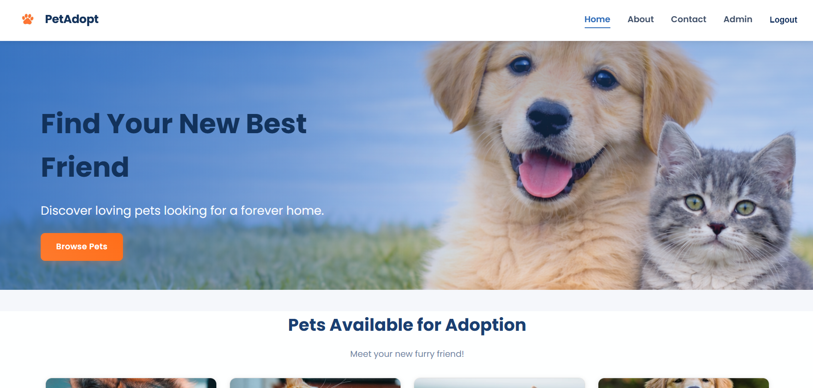
**Contact page**  
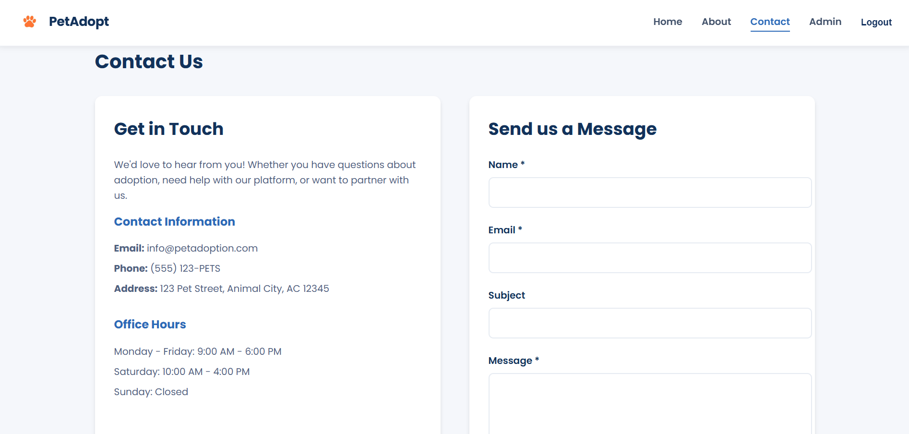
**Admin Dashboard**  
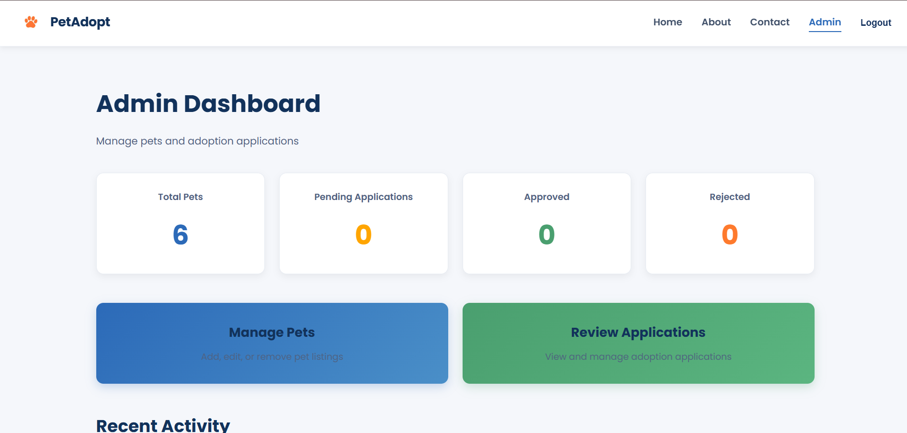
**Manage Pets by Admin**  
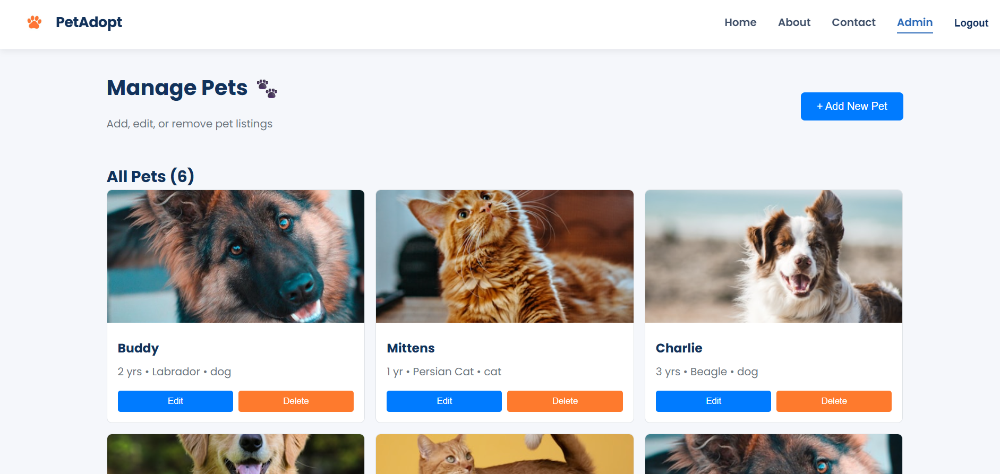
**Add Pet by Admin**  
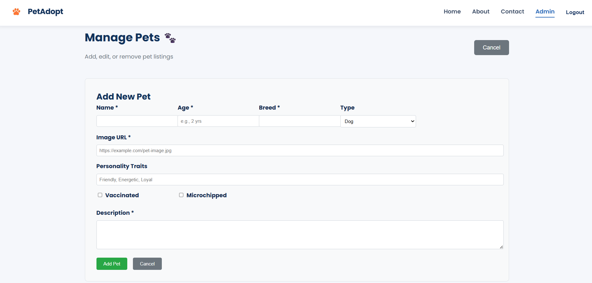
**Edit Pet by Admin**  
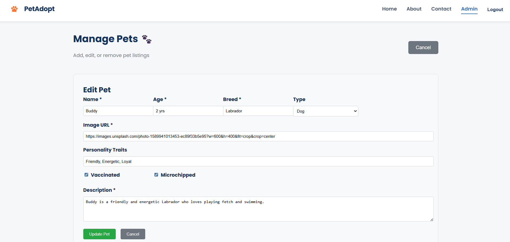
**Browse Pet**  
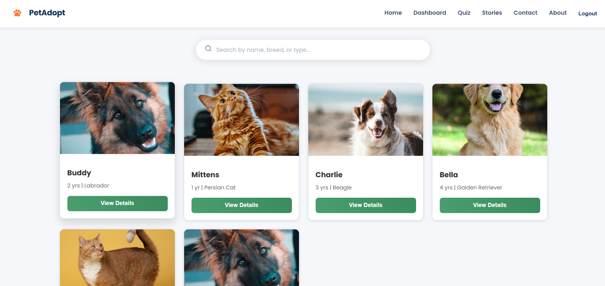
**User Dashboard**  
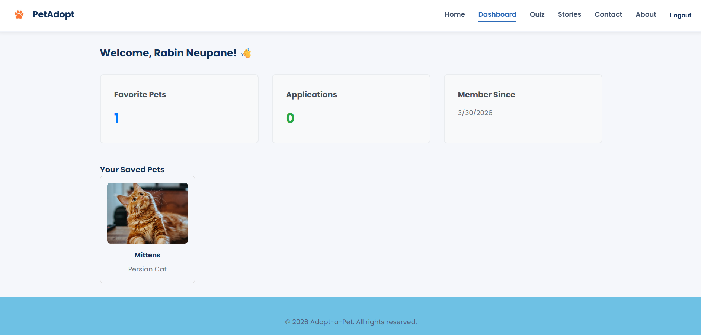
**Pet's Stories**  
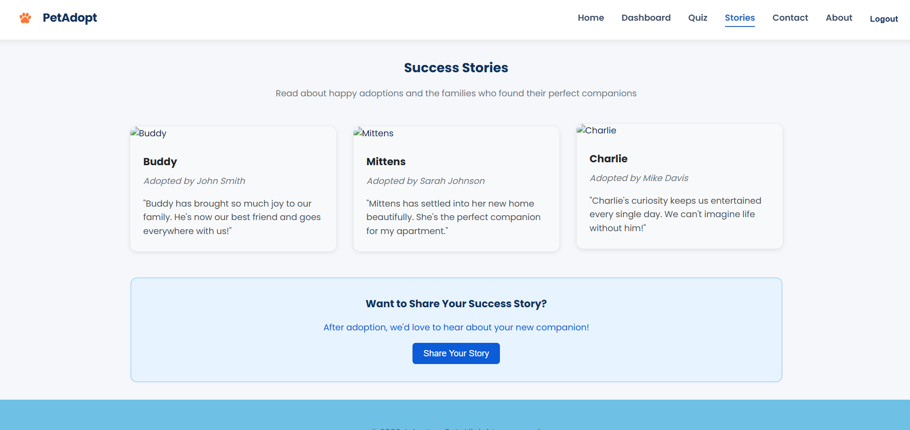
**Pet Selection Quiz**  
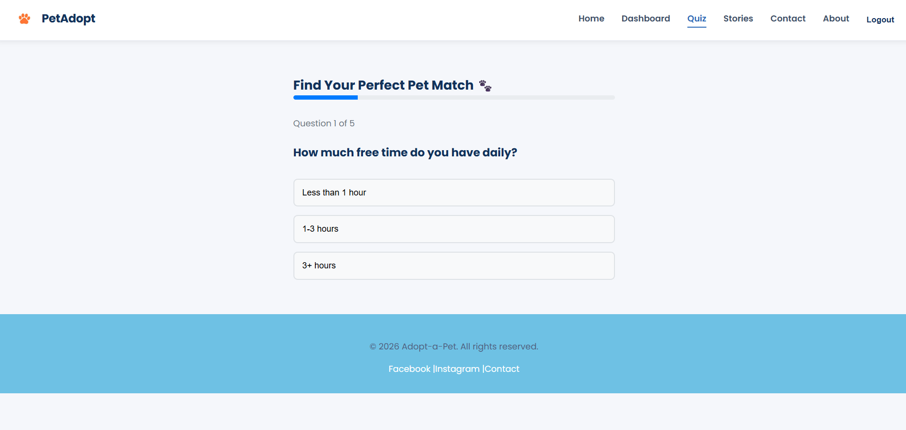
**Pet Adoption**  
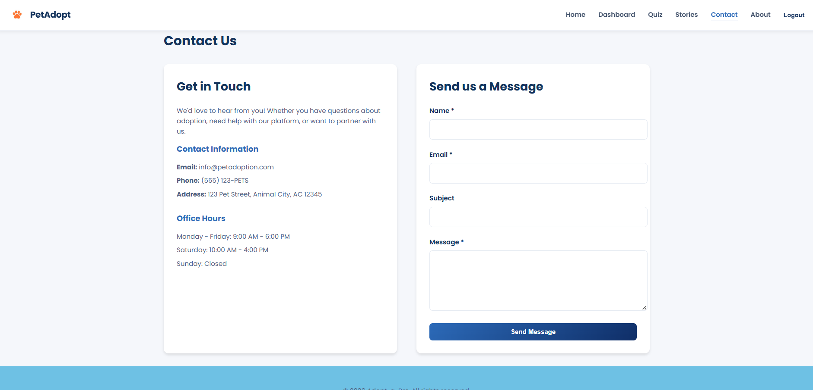
**About Us Page**  
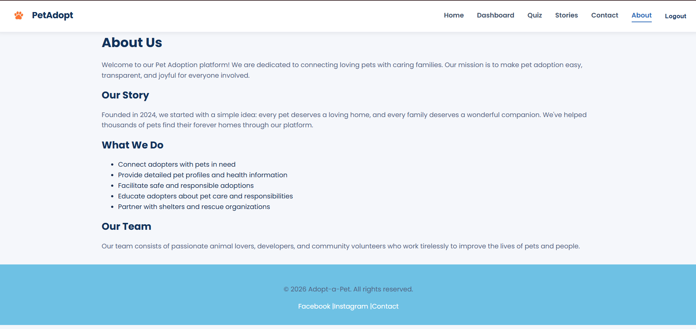

---

## Features

### Core Features
```
Pet Browsing — Search and filter through available pets with detailed profiles
Pet Details — View comprehensive information (images, breed, characteristics)
User Authentication — Secure login/signup system with role-based access
Favorites System — Save and manage favorite pets
Adoption Applications — Submit adoption requests for pets
Admin Dashboard — Manage pets (add/edit/delete) and review applications
## Advanced Features
Real-time API Integration — Pulls pet data from The Dog API
Pet Matching Quiz — Personalized quiz to match users with suitable pets
Success Stories — Showcase successful adoptions
Notification System — Real-time user feedback and notifications
LocalStorage Persistence — Data retained across sessions
Responsive Design — Full mobile and desktop support
## Technical Implementation
React 18 with custom hooks for reusable logic
Context API for global state management across 5 contexts (Auth, Pets, Favorites, Applications, Notifications)
React Router for single-page application navigation
Form Validation with error handling
CRUD Operations for pet and application management

The architecture is well-organized with dedicated components, context providers, custom hooks, and pages for different sections (Browse, Dashboard, Admin, Quiz, etc.), making it modular and maintainable.
```

### Core Functionality
```

* Browse pets with search and filters
* View detailed pet profiles (images, breed, information)
* User authentication (Login / Signup)
* Favorites system
* Adoption application system
* Admin dashboard
```

---

### Advanced Features

* Real-time API integration (The Dog API)
* LocalStorage persistence
* Desktop-friendly responsive UI Only
* Notification system
* Pet matching quiz
* Success stories section

---

### Technical Highlights
```
* React Hooks (`useState`, `useEffect`, `useContext`)
* React Router (SPA navigation)
* Context API (global state management)
* Custom Hooks (reusable logic)
* CRUD operations
* Form validation
* Error handling with loading states
```

---

## Tech Stack

| Category        | Technology       |
| --------------- | ---------------- |
| Frontend        | React 18         |
| Routing         | React Router DOM |
| Styling         | CSS3             |
| State Mgmt      | Context API      |
| Build Tool      | Vite             |
| Storage         | LocalStorage     |
| API             | The Dog API      |
| Package Manager | npm              |

---

## Installation

```bash
git clone https://github.com/Samriddhicollege/B.Sc.CSIT-2081-3rd-Semester-Sec-A-React-Pet-Adoption-Rabin-Neupane.git
cd pet-adoption-platform
npm install
npm run dev
```

## Live Demo:
**Live URL**
```
[http://localhost:5174](https://b-sc-csit-2081-3rd-semester-sec-a-r.vercel.app/)
```

---

```
## Project Structure
Pet_Adoption/
├── public/
├── src/
│   ├── assets/                          # Images, icons, media
│   ├── components/                      # Reusable UI components
│   │   ├── AdoptionModal.jsx
│   │   ├── Footer.jsx
│   │   ├── Navbar.jsx
│   │   ├── NotificationContainer.jsx
│   │   └── PetCard.jsx
│   ├── context/                         # Global state management
│   │   ├── ApplicationsContext.jsx      # Adoption applications state
│   │   ├── AuthContext.jsx              # User authentication state
│   │   ├── FavoritesContext.jsx         # Favorites management state
│   │   ├── NotificationContext.jsx      # Notification system state
│   │   └── PetsContext.jsx              # Pets data state
│   ├── data/
│   │   └── petsData.js                  # Static/initial pet data
│   ├── hooks/                           # Custom React hooks
│   │   ├── useApplications.js           # Adoption applications logic
│   │   ├── useAuth.js                   # Authentication logic
│   │   ├── useFavorites.js              # Favorites logic
│   │   ├── useNotification.js           # Notification logic
│   │   └── usePets.js                   # Pets data logic
│   ├── pages/                           # Page components (routes)
│   │   ├── About.jsx
│   │   ├── AdminApplications.jsx        # Admin: view applications
│   │   ├── AdminDashboard.jsx           # Admin: main dashboard
│   │   ├── AdminPets.jsx                # Admin: manage pets
│   │   ├── BrowsePets.jsx               # User: browse all pets
│   │   ├── Contact.jsx
│   │   ├── Dashboard.jsx                # User: personal dashboard
│   │   ├── Favorites.jsx                # User: saved favorites
│   │   ├── Home.jsx                     # Landing page
│   │   ├── Login.jsx                    # User login
│   │   ├── PetDetails.jsx               # Single pet details
│   │   ├── Quiz.jsx                     # Pet matching quiz
│   │   ├── Signup.jsx                   # User registration
│   │   └── SuccessStories.jsx           # Adoption success stories
│   ├── styles/
│   │   └── Notification.css
│   ├── App.jsx                          # Main app component
│   ├── main.jsx                         # Entry point
│   └── index.css                        # Global styles
├── eslint.config.js                     # ESLint configuration
├── vite.config.js                       # Vite build configuration
├── package.json                         # Dependencies & scripts
├── index.html                           # HTML template
└── README.md                         # Documentation
```

---
## Architecture Overview
```
Context Providers → Centralized state (5 contexts)
Custom Hooks → Encapsulated business logic (5 hooks)
Components → Reusable UI building blocks (5 components)
Pages → Route-level components (14 pages)
Data Layer → Static pet data
```

## Key Separation:
```
/context/ — State management
/hooks/ — Logic abstraction
/components/ — Presentational UI
/pages/ — Full page views
/styles/ — Styling (mostly inline CSS modules)
```

## Usage Guide

### For Users

1. Browse pets from the homepage
2. Use search and filters
3. View pet details
4. Save favorites
5. Apply for adoption

---

### For Administrators

```
Email: admin@petadoption.com  
Password: admin123
```

* Manage pets (Add / Edit / Delete)
* Review adoption applications

---

## API Integration

API used: The Dog API

Endpoint:

```
https://api.thedogapi.com/v1/images/search?limit=6&has_breeds=true
```

---

## License

MIT License

## Final Note

Built for pets and the people who care for them.
